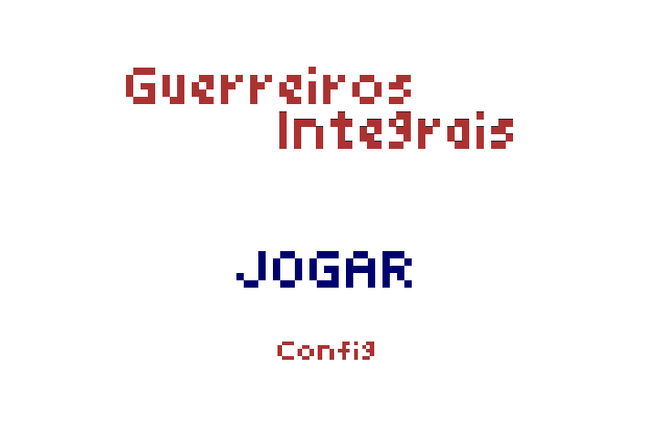
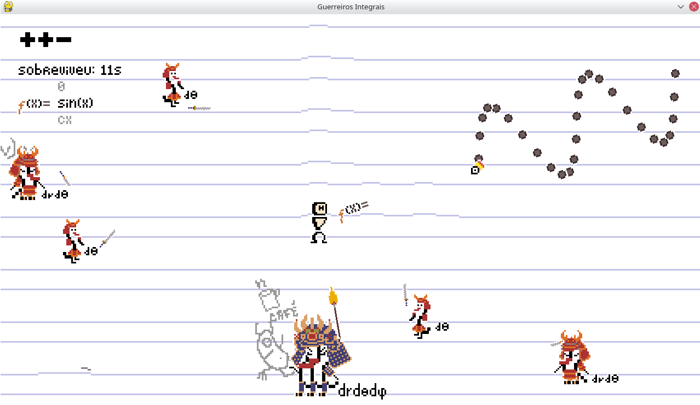

.. Guerreiros Integrais documentation master file, created by
   sphinx-quickstart on Sun Dec 10 01:37:13 2023.
   You can adapt this file completely to your liking, but it should at least
   contain the root `toctree` directive.

Guerreiros Integrais
================================================

.. toctree::
   :maxdepth: 0
   :hidden:

   genindex
   camera_doc
   cursor_doc
   enemies_doc
   game_doc
   health_doc
   map_doc
   menu_doc
   player_doc
   text_doc
   utils_doc
   weapons_doc

by Anne Cardoso, Larissa Lemos, Pedro Tokar and Vitor Nascimento.

Introduction
-------------

This game is our work for the second evaluation in the Programming Languages
subject, lectioned at the second semester of the courses Data Science and Applied
Mathematics in FGV - EMAp.

During the second part of the PL course, we learnt about **Object Oriented
Programing** concepts, in parallel with applying them to Python programs. This
work aims to show the concepts we learnt so far (like encapsulation and
inheritance) applied in a game, developed entirely by us.

About the game
----------------

In this game, you control a brave warrior that should fight against evil integrals
in a notebook. This fight never ends, like the pain in solving hard triple integrals
in calculus II classes. The game objective is to defeat the maximum amount of
integrals you can, lasting as long as possible without dying. You can move the
player with the **WASD keys**, shoot with the **right mouse button** and change
guns using the **mouse scroll**.

The game genre chosen by the group was a top-down shooter, decided after voting.
This game uses concepts like maps, a player, enemy, weapons, guns, etc., and all
of these are represented as classes in the code. There is also a game loop,
responsible for accounting the endless events that can occur each frame, like
a gun being shot and a player taking damage.

Running
----------

In order to run the game, you need to have `Python <https://www.python.org/>`_
installed (version 3.9 or higher) in your system. How to install python differs
greatly from operational system to operational system. Once you have installed
python, you also need the `pygame <https://www.pygame.org/news>`_ library. The
library abstracts a lot of things involving creating windows and drawing in them.

To install it, you can run on your terminal, from the project root:

$ pip install - r requiriments.txt

After that, you have all the necessary things to run the game. So, to do it, run:

$ python src/main.py

Documentation
--------------

Almost all of the game code is made by clases. They are divided by modules, each
module having his own "theme" of clases. It is possible to acess the documentations
of each module (and by so, each class) using the below reference, or navigating
through the tree of contens in the left of the pages.

* :ref:`modindex`
